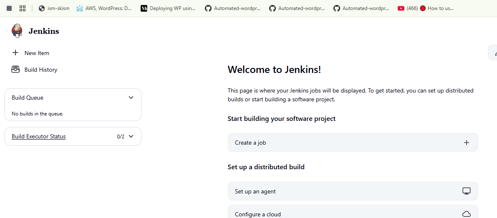
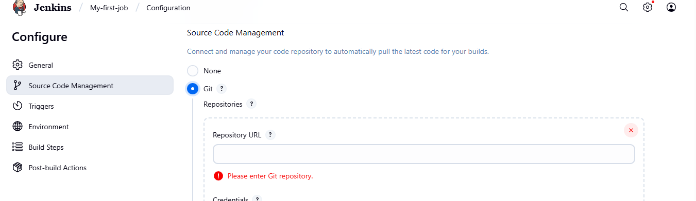
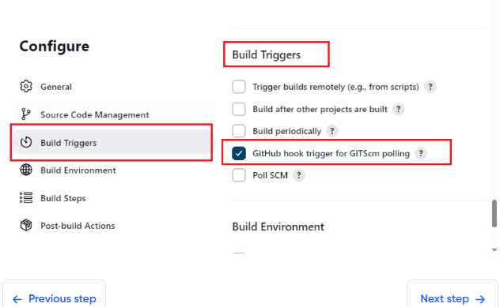
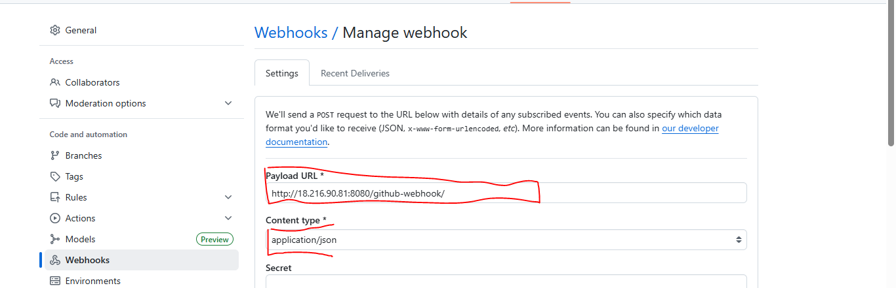
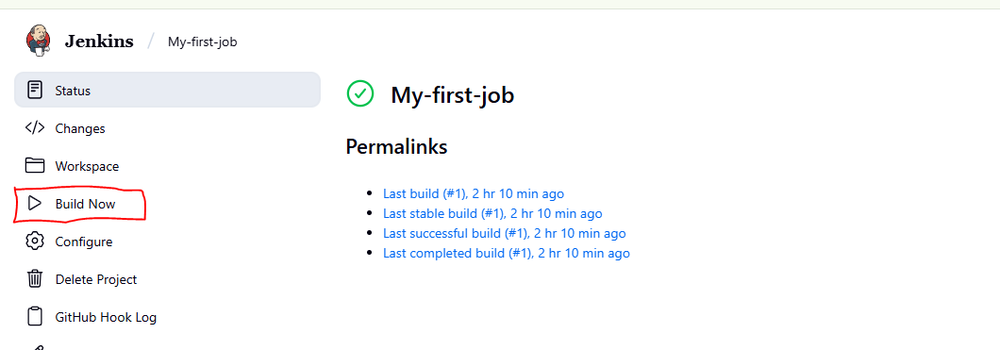
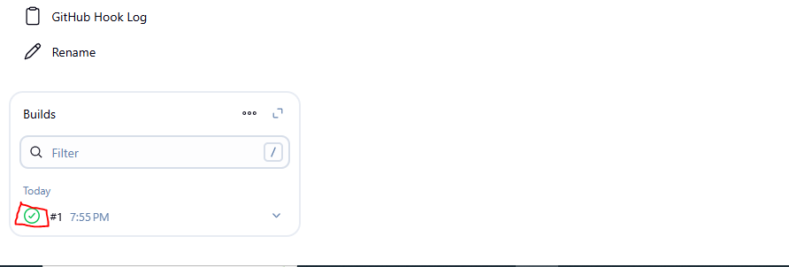
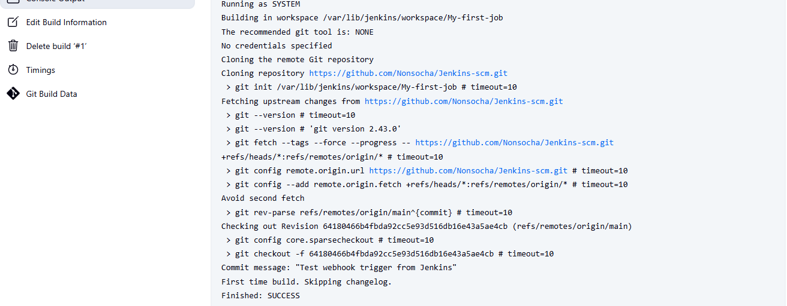

# JENKINS PROJECT
## Jenkins Job
## Creating a Freestyle Project
1) From the the dashboard menu on the left side bar, click on new item
   
   

 ii.  Create a freestyle project and name it "MY-first-job"

  ## Connect Jenkins To Our Source Code Management
  ## Steps in connecting Jenkins with Github

  1)  Create a github repository  called "Jenkins-scm with a README file
  2)  Connect jenkins with the Jenkins-scm repository by pasting the url in the area selected below.Ensure the current  branch is main.
   

  3) Save configuration and run "Build Now" to connect jenkins to the repository.

# Configuring Build Trigger
 For us to make things easy we need to automate our work,But since we have already  Build,we can't run a new build with clickung on "Buld Now" .To eliminate this we need to configure a build trigger to our jenkins job.with this jenkins we run a new build whenever there is a change in the the github repository.
 
 1) Click "Configure" your job and add this configurations
 2) Click on build trigger to configure triggering the job from github webhook.

 3) Create a a github webhook using jenkins ip and port
   
   N/B: Your payload url is a content of the ip address and the the jenkins port
   
> <https://ec2 public ip >:8080/github/webhook/

Contet-type should be in application/json

4)  Click on "Build Now"
  

5) After build click on the green icon in the build Box to check the outcome.
   

   

    

